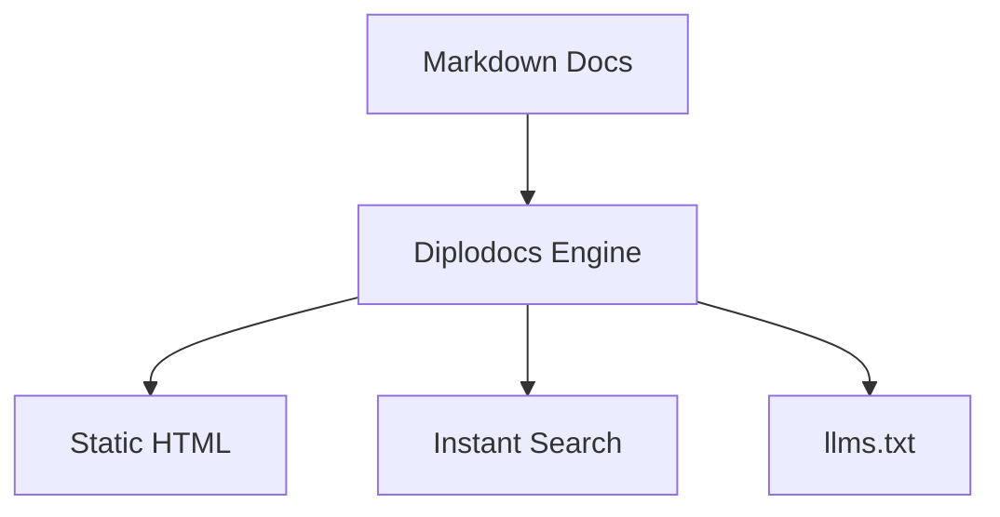

# 🦕 Diplodocs

> **Colossal documentation with a long reach — zero configuration, modern batteries included.**

Diplodocs is a blazingly fast documentation engine written in Go, crafted as a sleek, opinionated alternative to MkDocs.

While MkDocs requires 5–10 third-party plugins (`pymdown-extensions`, `mkdocs-material`, `mkdocs-awesome-pages`) and 60+ lines of nested YAML configuration just to get standard modern features, Diplodocs is **batteries-included and zero-config by default**.

---

## 🌟 The Diplodocs USP

| Feature | MkDocs Vanilla | MkDocs + Material | **🦕 Diplodocs** |
| :--- | :---: | :---: | :---: |
| **Setup & Dependencies** | Python + pip | 10+ pip packages | **1 static Go binary (zero deps)** |
| **Config Required** | YAML boilerplate | 50+ lines YAML | **Zero-config (runs out of the box)** |
| **Admonitions / Callouts**| ❌ | ⚠️ (Requires PyMdown) | **✅ Native GitHub & Material syntax** |
| **Code Tabs & Copy** | ❌ | ⚠️ (Requires PyMdown) | **✅ Native** |
| **Mermaid Diagrams** | ❌ | ⚠️ (Requires JS config) | **✅ Native client-side rendering** |
| **Filesystem Auto-Nav** | ❌ (Manual `nav:`) | ❌ (Needs extra plugin)| **✅ Automatic with prefix cleanup** |
| **Instant Client Search**| Basic Lunr | Worker/Lunr | **✅ Fast fuzzy modal search (Ctrl+K)** |
| **GitHub Stars & Forks** | ❌ | Requires plugin/theme | **✅ Native cached GitHub card** |
| **Version Badge** | ❌ | Requires theme config | **✅ Native `version = "v..."`** |
| **"Edit this page" Link** | ❌ | Requires manual URI setup | **✅ Auto-computed GitHub edit links** |
| **Reading Time Estimation** | ❌ | Requires plugin | **✅ Native per-page reading time** |
| **AI / Agent Context** | ❌ | ❌ | **✅ Built-in `/llms.txt` & `/llms-full.txt`** |
| **Build Speed** | Moderate | Slow on large docsets | **⚡ Millisecond builds in pure Go** |

---

## 🚀 Quick Start

### 1. Build and Install
```bash
git clone https://github.com/diplodocs/diplodocs.git
cd diplodocs
go build -o diplodocs ./cmd/diplodocs
```

### 2. Scaffold a Documentation Site
```bash
./diplodocs new my-docs
cd my-docs
```

### 3. Start Live-Reload Dev Server
```bash
diplodocs dev
```
Open [http://localhost:8080](http://localhost:8080). Editing any markdown file triggers an instant Server-Sent Events (SSE) reload.

### 4. Build Static Site for Production
```bash
diplodocs build
```
Generates a static site inside `dist/` ready to host anywhere (GitHub Pages, Netlify, Vercel, S3).

---

## 📂 Automatic Filesystem Navigation

Diplodocs doesn't force you to write tedious `nav:` trees in YAML. It automatically discovers your documentation hierarchy from your directory layout:

```text
docs/
├── index.md                 # Home page
├── 01-get-started/
│   ├── 01-installation.md   # Sorted first, title: "Installation"
│   └── 02-quickstart.md     # Sorted second, title: "Quickstart"
└── 02-guides/
    ├── 01-diagrams.md       # "Diagrams"
    └── deployment.md        # "Deployment"
```

Numeric prefixes like `01-` and `02-` control the sidebar display order while keeping titles clean and readable.

---

## 🎨 Markdown Batteries Included

### GitHub-style Callouts
```markdown
> [!NOTE]
> Highlights information that users should take into account.

> [!TIP]
> Helpful tips and best practices.

> [!WARNING]
> Urgent alerts and breaking change notifications.
```

### Code Tabs
```markdown
=== "Go"
    ```go
    fmt.Println("Hello Diplodocs")
    ```

=== "Python"
    ```python
    print("Hello Diplodocs")
    ```
```

### Mermaid Diagrams
Fenced code blocks marked with `mermaid` render interactive SVG diagrams automatically:

```markdown

```

---

## 🤖 AI / Agent Ready (`/llms.txt`)

Every `diplodocs build` automatically emits:
* `/llms.txt` — Standard machine-readable documentation index.
* `/llms-full.txt` — Complete single-file markdown bundle of all docs, ideal for ingestion by AI coding assistants (Copilot, Claude, Cursor, Antigravity) without web scraping.

---

## ⚙️ Configuration (`diplodocs.toml`)

Configuration is **100% optional**. When customization is desired, add `diplodocs.toml`:

```toml
[site]
name = "My Project"
description = "Modern tools for modern developers"
repo_url = "https://github.com/myorg/myproject"
version = "v1.0.0"
edit_branch = "main"

[theme]
accent = "emerald"      # emerald, ocean, amber, rose, purple
dark_mode = "auto"       # auto, light, dark
logo_text = "🦕 My Project"

[features]
search = true
mermaid = true
copy_button = true
llms_txt = true
repo_stats = true
reading_time = true
edit_link = true
```

---

## 🛠️ CLI Commands

* `diplodocs new [dir]` — Scaffold a new documentation project with sample docs.
* `diplodocs dev [--port 8080]` — Launch the local development server with live reload.
* `diplodocs build` — Compile static site to `dist/`.
* `diplodocs check` — Scan markdown documents for broken internal links and images.
* `diplodocs version` — Display version and ASCII mascot.

---

## 📜 License

MIT License. Built with 🦕 by the Diplodocs community.
