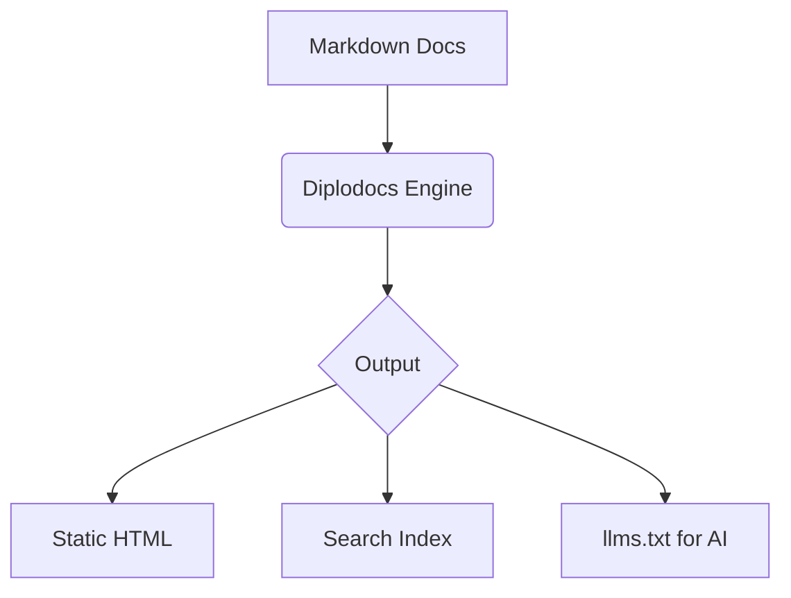
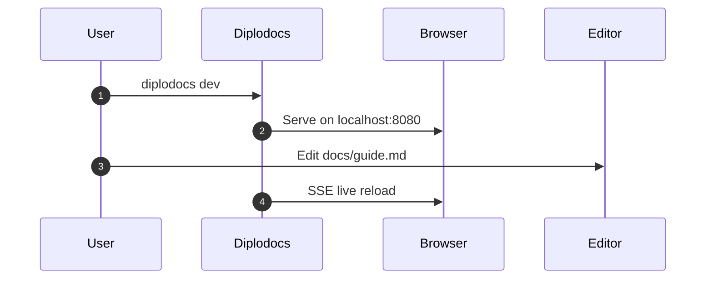

# Diagrams & Visuals

Diplodocs includes native support for Mermaid.js diagrams.

## Flowchart Example

```mermaid
graph TD
    A[Markdown Docs] --> B(Diplodocs Engine)
    B --> C{Output}
    C --> D[Static HTML]
    C --> E[Search Index]
    C --> F[llms.txt for AI]
```

## Architecture Sequence

```mermaid
sequenceDiagram
    autonumber
    User->>Diplodocs: diplodocs dev
    Diplodocs->>Browser: Serve on localhost:8080
    User->>Editor: Edit docs/guide.md
    Diplodocs->>Browser: SSE live reload
```
